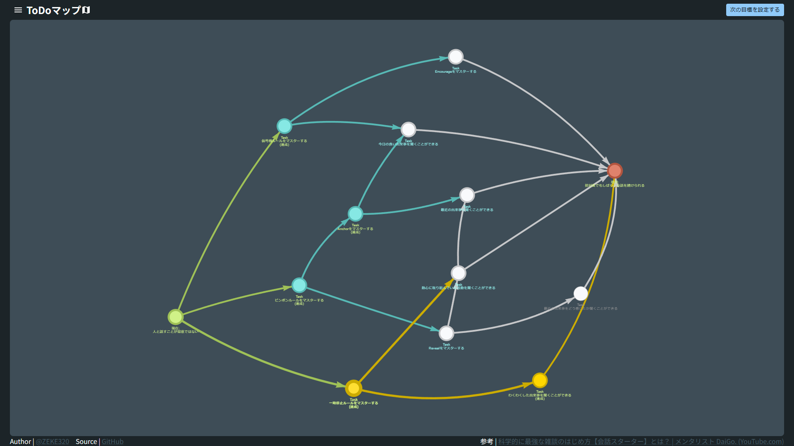
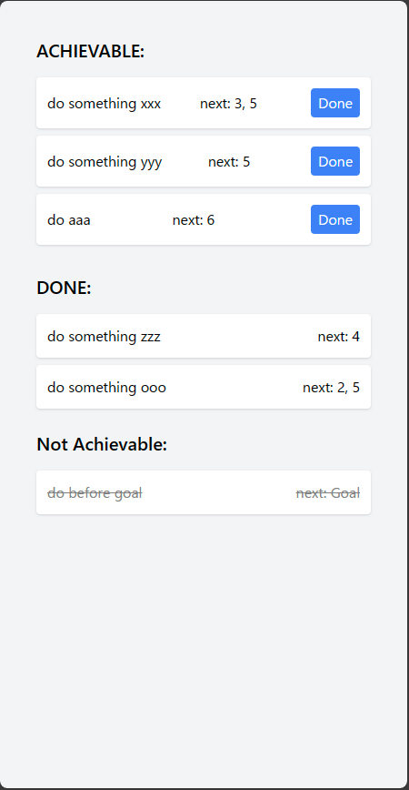

# ToDoマップ

## コンセプト

**目標達成のGoogle Map**

現状から目標までのギャップをToDoで繋げ、地図に変換・ルート案内するアプリ

## デモ

最新のデモは[こちら](https://zeke320-todo-map.vercel.app/)から

## 目次

- [ToDoマップ](#todoマップ)
  - [コンセプト](#コンセプト)
  - [デモ](#デモ)
  - [目次](#目次)
  - [概要](#概要)
  - [操作方法](#操作方法)
  - [参考](#参考)

## 概要

make realで生成したコンセプト([pdf](concepts/todo-map/todo-map-concept.pdf), [html](concepts/todo-map/todo-map-concept.html))をもとに作成したモックアプリです。

今後の実装としては、

- 現状と目標を自身で入力して、あらゆる目標達成に用いられるようにする機能
- 可能な限り科学的根拠に基づいて中間ノードを自動生成する機能
- サイドバーに一般的なTODOリストを追加し、ノードリンク図と同期して変更や追跡をする機能
- 地図アプリのように、
  - 自身の得意分野から攻略するルート
  - 苦手分野を着実に達成するルート
  - まんべんなくノードを達成して、スキルを盤石なものとするルート  
  などなど、ユーザーの意向で任意のルートを選択する機能
- Word2Vecなどでコンセプト間の距離（達成難易度）を自動で計算する機能
- ToDoノードをクリックすることで、そのToDoがなぜ必要なのか、達成するとどのようなメリットがあるかを表示する機能

などを想定しています。

## 操作方法

- それぞれのノードは、現状（緑）、目標（赤）、ToDo（グレー）を表しています。
- 文字色が緑色のToDoノードは現在の自分が達成することのできる（または既に達成している）ノードです。
- 達成可能なノードを選択すると青色に光り、ToDoが達成されます。
- 理想ノードまでひと繋ぎにToDoを達成すると、それまで達成したToDoが黄色に光ります。次の目標を設定するもよし、引き続き未達成のToDoを進めるもよしです。
- 理想ノードに到達後は、右上のボタンからいつでも次の目標を設定できます。

## 参考

1. TODOマップ
    1. make realへの入力プロンプト

        

    1. make realの出力

        [make realの出力HTML](concepts/todo-map/todo-map-concept.html)

        

1. TODOリスト サイドメニュー

    1. make realへの入力プロンプト

        

    1. make realの出力

        [make real sidemenuの出力HTML](concepts/todo-list-sidemenu/todo-list-sidemenu-concept.html)

        

1. [make real・tldraw | makereal.tldraw.com](https://makereal.tldraw.com/)

1. [Dラボ | daigovideolab.jp](https://daigovideolab.jp/)

1. [科学的に最強な雑談のはじめ方【会話スターター】 | youtube.com](https://www.youtube.com/watch?v=aPPQPCMrEzo)

1. [科学的に最強な雑談のはじめ方【会話スターター】とは？ | daigovideolab.jp](https://daigovideolab.jp/play/1586367723)

1. [メンタリストDaiGo. 超トーク力. CCCメディアハウス, 2021.](http://books.cccmh.co.jp/list/detail/2112/)
